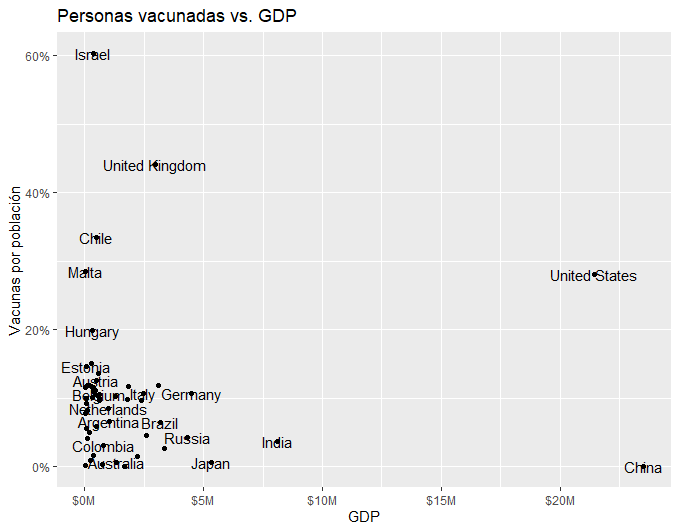
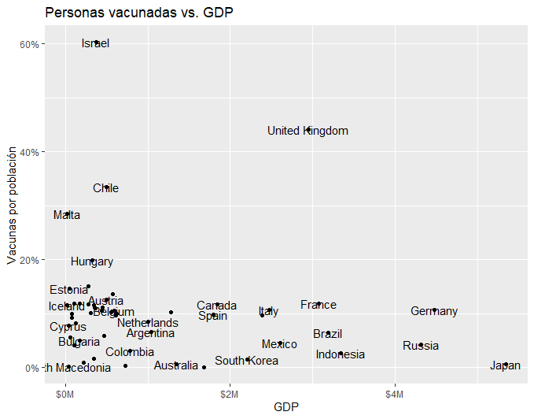
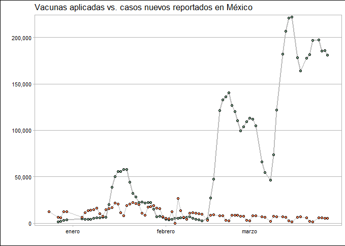

# Introducción
**Objetivo:** Analizar de manera global y nacional el avance de las vacunas contra el *COVID-19*, tomando en cuenta diferentes variables relevantes.
Para tener una noción de las aplicaciones de las diferentes vacunas de COVID-19, se hizo un análisis con la ayuda de diferentes bases de datos y visualizaciones para abordar esta temática. 

Las bases de datos que se utilizaron:
-     Registro de las vacunas aplicadas
      - Variables: Personas vacunadas, personas totalmente vacunadas (con segunda dosis aplicada, tipo de vacuna aplicada)
-     Número de casos reportados de COVID-19 
      - Variables: casos nuevos reportados, casos totales.
-     Número de habitantes por país
-     Producto Interno Bruto por país (**OECD**).

.footnote[
Proyecto en R disponible en mi [github](https://github.com/graf-anapaula/covid_vaccines)
]
```{r setup, include=FALSE}
knitr::opts_chunk$set(
 fig.width = 7,
 fig.asp = 0.8,
 out.width = "50%"
)
```

```{r lectura y librerias, message=FALSE, warning=FALSE, include=FALSE, paged.print=FALSE}
library(tidyverse)
library(scales)
library(hrbrthemes)
library(sysfonts)
library(ggthemes)
library(stringr)

cases <- read_csv(here::here("data/raw/owid-covid-data.csv"))
vaccines <- read_csv(here::here("data/raw/country_vaccinations.csv"))
population <- janitor::clean_names(read_csv(here::here("data/raw/WPP2019_TotalPopulationBySex.csv"))) %>% 
  filter(time == 2021, variant == "Medium") %>% 
  select(country = location, pop_total)

```
---
# Primeros insights
## Crecimiento del número de vacunas aplicadas al día
De aquellos países con los mayores promedios de vacunas aplicadas por día se extrajo una gráfica de los 5 mejores en la que se representara el crecimiento de las vacunas aplicadas a lo largo del 2021. Con el objetivo de representar qué países tienen una estrategia efectiva en la aplicación de éstas.

```{r echo=FALSE, message=FALSE, warning=FALSE, fig.align='left'}
daily_info <- vaccines %>% 
  select(country, daily_vaccinations) %>% 
  group_by(country) %>% 
  summarise(daily_mean = mean(daily_vaccinations, na.rm  = TRUE)) %>% 
  filter(country != "England") %>% 
  arrange(desc(daily_mean)) 

paises <- daily_info %>% 
  head(5) %>% 
  select(country) %>% 
  pull()

crecimiento <- vaccines %>% 
  select(country, date, daily_vaccinations) %>% 
  group_by(country, date) %>% 
  summarise(daily_mean = mean(daily_vaccinations, na.rm  = TRUE)) %>% 
  filter(country %in% paises) %>% 
  mutate(date = parse_date(date, format = "%d/%m/%Y"))

crecimiento %>% mutate(País = country) %>% 
  ggplot(aes(date, daily_mean, color = País)) +
  geom_line(size = 1) +
  scale_y_comma() +
  xlab(NULL) + ylab(NULL) +
  ggtitle("Crecimiento de las Vacunas a lo largo del 2021") +
  scale_color_brewer(palette = "Dark2") +
  theme_calc()
  
```
.pull-right[**Conclusiones:** Podemos observar, los promedios más altos de la aplicación son *Estados Unidos* y *China*. Asimismo, nos percatamos de que aunque *India* empezó su estrategia después, se encuentra en la actualidad en el 3er lugar.]
---
Se identificaron los 20 países con mayor promedio de vacunas aplicadas diariamente.

```{r echo=FALSE, fig.align='center'}
top_5 <- daily_info %>% head(5) %>% select(country) %>% pull()

daily_info %>%
  head(20) %>% 
  arrange((daily_mean)) %>% 
  mutate(country = factor(country, levels = country)) %>% 
  ggplot(aes(country, daily_mean)) +
  geom_segment(aes(x = country, xend = country, y = 0, yend = daily_mean), color = "skyblue") +
  geom_point(color = "blue", size = 4, alpha = 0.6) +
  scale_y_continuous(limits = c(0, 2000000), breaks = seq(0, 1500000, by = 250000), labels = label_comma()) +
  theme_light() +
  coord_flip() +
  theme(
    panel.grid.major.y = element_blank(),
    axis.ticks.y = element_blank()
  ) +
  labs(x = "País", y = "", title = "Promedio de vacunas diarias", subtitle = "Top 20 países")
  
```
<br>
Como podemos observar, China y Estados Unidos entran en los promedios más altos en cuanto aplicación de la vacuna. Sin embargo, es relevante tomar en cuenta la magnitud de su población por lo que a para evaluar la eficiencia de cada país para la aplicación de las vacunas se obtuvo el *porcentaje de la población vacunada* de cada país.  
---
# Porcentaje de población vacunada
```{r echo=FALSE, message=FALSE, warning=FALSE}
data <- read_csv(here::here('data/interim/vacunas_gdp.csv'))
data_scaled <- data %>% 
  arrange(desc(percent_fully_vaccinated)) %>% 
  mutate('Personas vacunadas' = scales::percent(percent_vaccinated, accuracy = 1L),
         'Personas totalmente vacunadas' = scales::percent(percent_fully_vaccinated, 1L)) %>% 
  select('País' = country, 'Personas vacunadas', 'Personas totalmente vacunadas') 

DT::datatable(data_scaled, fillContainer = FALSE, options = list(pageLength = 8))
```
---
# Producto Interno Bruto (PIB)
Por otro lado, se indago si existía una relación entre el PIB o Growth Domestic Product (GDP) y la aplicación de las vacunas.
.pull-left[

]
.pull-right[

]
<br>
La imagen de la derecha son todos los países de la base de datos, mientras que en la derecha se filtraron China, Estados Unidos e India para poder apreciar la distribución de los otros países. 
---
Para un análisis más profundo se calculó la siguiente prueba de hipótesis:
<br>
$$H_{0}: \rho _{x,y} = 0 \space vs.\space H_{a}:\rho _{x,y}  \neq 0$$
<br>
Donde $x$ representa el *GDP* y $y$ el porcentaje de *población vacunada*.

```{r message=FALSE, warning=FALSE, include=FALSE, paged.print=TRUE}
test_full <- read_csv("datasets/test_fully.csv")
estimate <- test_full %>% select(estimate) %>% pull()
p_value <-  test_full %>% select(p.value) %>% pull()
```

El *valor-p* asociado a la prueba: `r toString(round(p_value, 2))` y el *valor estimado* `r round(estimate, 2)`. Por lo que, tenemos información estadística para concluir que la correlación entre el GDP y el porcentaje de vacunas aplicadas no es significativa.
---
# ¿Cómo va México?

Podemos observar que mientras que el número de casos ha ido disminuyendo, el número de vacunas aplicadas ha disminuido. 
---
```{r}
daily <- read_csv(here::here("data/interim/dalily_mx_usa.csv"))
daily %>% 
  filter(iso_code %in% c('MEX', 'USA'), week < 49) %>%
  ggplot(aes(week, new_cases)) +
  geom_point(color = 'grey')  +
  geom_line(aes(color = country)) +
  scale_y_continuous(labels = scales::comma_format()) +
  ylab("Vacunas aplicadas") +
  theme(legend.position = 'top') +
  labs(color = "Country") +
  ggtitle("Número de vacunas aplicadas semanalmente") +
  xlab("") +
  scale_x_continuous(breaks = c(4, 8, 12, 16),
                     labels = c("Enero", "Febrero", "Marzo", "Abril")) 
```


